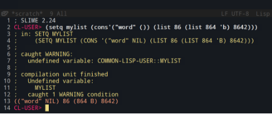
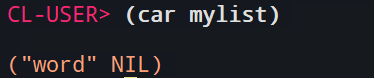
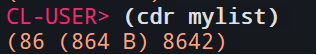
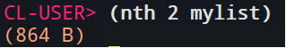
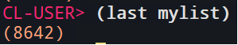
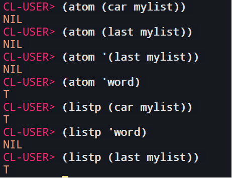
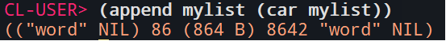
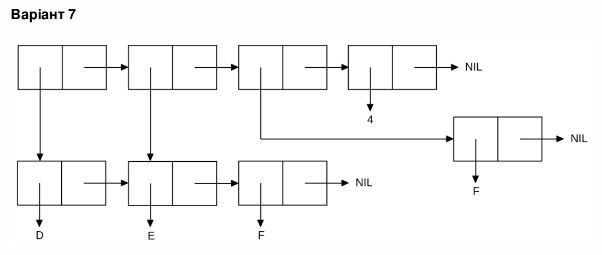
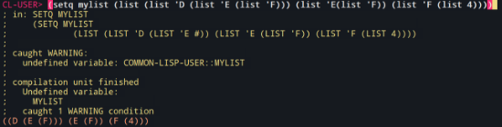



НАЦІОНАЛЬНИЙ ТЕХНІЧНИЙ УНІВЕРСИТЕТ УКРАЇНИ «КИЇВСЬКИЙ ПОЛІТЕХНІЧНИЙ ІНСТИТУТ імені Ігоря Сікорського»

ФАКУЛЬТЕТ ПРИКЛАДНОЇ МАТЕМАТИКИ

Кафедра системного програмування та спеціалізованих комп’ютерних систем

**Лабораторна робота №1**
**

Виконав: 

студент групи КВ-11

Угнівенко Ярослав

Київ – 2024

**Перша частина:**

1\. Створіть список з п'яти елементів, використовуючи функції LIST і CONS . Форма створення списку має бути одна — використання SET чи SETQ (або інших допоміжних форм) для збереження проміжних значень не допускається. Загальна кількість елементів (включно з підсписками та їх елементами) не має перевищувати 10-12 шт. Збережіть створений список у якусь змінну з SET або SETQ . Список має містити (напряму або у підсписках):

\- хоча б один символ

\- хоча б одне число

\- хоча б один не пустий підсписок

\- хоча б один пустий підсписок

2\. Отримайте голову списку.

3\. Отримайте хвіст списку.

4\. Отримайте третій елемент списку.

5\. Отримайте останній елемент списку.

6\. Використайте предикати ATOM та LISTP на різних елементах списку (по 2-3 приклади для кожної функції).

7\. Використайте на елементах списку 2-3 інших предикати з розглянутих у розділі 4 навчального посібника.

8\. Об'єднайте створений список з одним із його непустих підсписків. Для цього використайте функцію APPEND .

Введемо команду для створення списку:

(setq mylist (cons'("word" ()) (list 86 (list 864 'b) 8642))

“word” — символ. 

() — пустий підсписок.

86, 8642 — числа.

(list 864 'b) — непустий підсписок.

Отримаємо:

В даному випадку отримали попередження, про те, що змінна mylist не була ініацілізована до цього (defvar).

Приступимо до почергового виконання команд:

2\. Отримайте голову списку.

3\. Отримайте хвіст списку.

4\. Отримайте третій елемент списку.

5\. Отримайте останній елемент списку.

6\. Використайте предикати ATOM та LISTP на різних елементах списку (по 2-3 приклади для кожної функції).

7\. Використайте на елементах списку 2-3 інших предикати з розглянутих у розділі 4 навчального посібника.

8\. Об'єднайте створений список з одним із його непустих підсписків. Для цього використайте функцію APPEND .

**Друга частина:**

Створіть список, що відповідає структурі списку, наведеній на рисунку (за варіантом). Для цього допускається використання не більше двох форм.

Варіант 23 (7)

Як бачимо, маємо 3 порожні послідовні списки, в яких є непорожні підсписки. Створимо такий список:

(setq mylist (list (list 'D (list 'E (list 'F))) (list 'E(list 'F)) (list 'F (list 4))))

Для прикладу, якщо взяти весь список і вписати car, ми отримаємо перший елемент – (D(E(F))), якщо в даному підсписку використаємо cdr ми отримаємо (E(F)), ну і повторно використавши cdr – (F).

Лістинг:

; Перша частина

;

;

; SLIME 2.24

CL-USER> (setq mylist (cons'("word" ()) (list 86 (list 864 'b) 8642)))

; in: SETQ MYLIST

;     (SETQ MYLIST (CONS '("word" NIL) (LIST 86 (LIST 864 'B) 8642)))

; 

; caught WARNING:

;   undefined variable: COMMON-LISP-USER::MYLIST

; 

; compilation unit finished

;   Undefined variable:

;     MYLIST

;   caught 1 WARNING condition

(("word" NIL) 86 (864 B) 8642)

CL-USER> (car mylist)

("word" NIL)

CL-USER> (cdr mylist)

(86 (864 B) 8642)

CL-USER> (nth 2 mylist)

(864 B)

CL-USER> (last mylist)

(8642)

CL-USER> (atom (car mylist))

NIL

CL-USER> (atom (last mylist))

NIL

CL-USER> (atom '(last mylist))

NIL

CL-USER> (atom '**word**)

T

CL-USER> (listp (car mylist))

T

CL-USER> (listp '**word**)

NIL

CL-USER> (listp (last mylist))

T

CL-USER> (numberp (last mylist))

NIL

CL-USER> (numberp 86)

T

CL-USER> (null ())

T

CL-USER> (null (car mylist))

NIL

CL-USER> (append mylist (car mylist))

(("word" NIL) 86 (864 B) 8642 "word" NIL)

;

;

; Друга частина

;

;

CL-USER> (setq mylist (list (list 'D (list 'E (list 'F))) (list 'E(list 'F)) (list 'F (list 4))))

; in: SETQ MYLIST

;     (SETQ MYLIST

;             (LIST (LIST 'D (LIST 'E #)) (LIST 'E (LIST 'F)) (LIST 'F (LIST 4))))

; 

; caught WARNING:

;   undefined variable: COMMON-LISP-USER::MYLIST

; 

; compilation unit finished

;   Undefined variable:

;     MYLIST

;   caught 1 WARNING condition

((D (E (F))) (E (F)) (F (4)))

CL-USER> 

